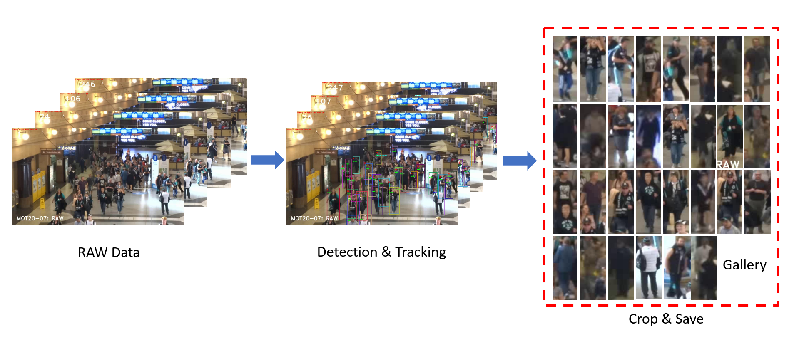
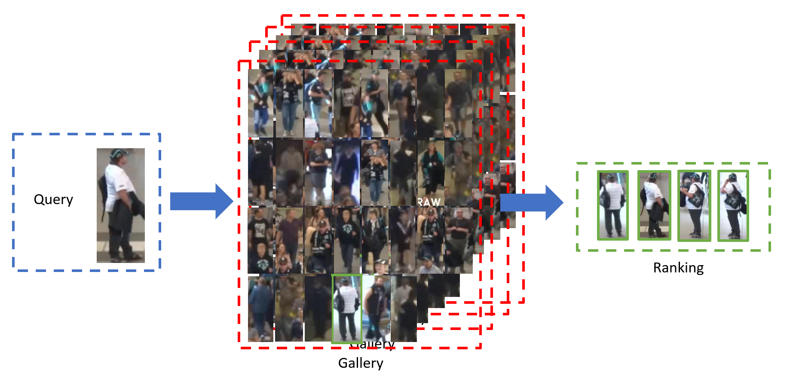

# Vidoe tracking+Re identification+Action recognition Demo

Our demo code can do Action recognition, Tracking, and Re-identification. Recognizable actions can be classified as walk, carry cargo, telephone, and stand.

**Our full code will be released on December 29th.**

## Tracking

paper : FairMOT: On the Fairness of Detection and Re-Identification in Multiple Object Tracking (https://arxiv.org/abs/2004.01888)

code  : https://github.com/ifzhang/FairMOT

## Re-identification

paper : Bag of Tricks and A Strong Baseline for Deep Person Re-identification (https://arxiv.org/abs/1903.07071)

code  : https://github.com/michuanhaohao/reid-strong-baseline

## Action Recognition

paper : SlowFast Networks for Video Recognition (https://arxiv.org/abs/1812.03982)

code  : https://github.com/facebookresearch/SlowFast

## Demo

  

## Pipeline

  

  

